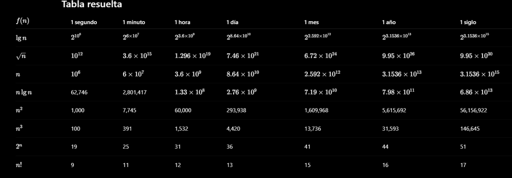

# Algoritmos como tecnología

Debemos elegir algoritmos que utilicen eficientemente los recursos de tiempo y espacio ya que las computadoras no pueden ser infinitamente rápidas.

### Eficiencia

Los algoritmos para resolver el mismo problema suelen diferir drásticamente en su eficiencia
**Por ejemplo:** Se presentan dos algoritmos de ordenación. El primero conocido como ***ordenación por inserción*** tarda aproximadamente un tiempo proporcional a: $$c_1 n^2$$para ordenar *n* elementos, donde: $$c_1$$ es una constante que no depende de *n*. Es decir tarda aproximadamente un tiempo proporcional a: $$n^2$$
El segundo, ***la ordenación por fusión***, tarda aproximadamente un tiempo igual a $$c_2 log(n)$$
donde *log(n)* representa: $$log_2 n$$
Y: $$c_2$$
es otra constante que tampoco depende de *n*. La ordenación por Inserción suele tener un factor constante menor que la ordenación por fusión, de modo que *c1 < c2*

Veremos que los factores constantes pueden tener un impacto mucho menor en el tiempo de ejecución que la dependencia del tamaño de la entrada *n*.

Denotemos el tiempo de ejecución del algoritmo de ordenación por *Inserción* como: $$c_1nn$$y el algoritmo de ordenación por *Fusión* como: $$c_2nln(n)$$
Observemos que mientras el algoritmo de ordenación por Inserción tiene tiene un factor de n en su tiempo del ejecución, el algoritmo de ordenación por *Fusión* tiene un factor log(n) mucho menor. Por ejemplo cuando n = 1000 entonces ln(1000) = 10

Si bien el algoritmo de ordenación por *Inserción*  suele ser mas rápido que el de Fusión para tamaños de entrada pequeños, una vez que el tamaño de la entrada *n* es lo suficientemente grande, la ventaja de ln(n) sobre n del algoritmo de ordenación por *Fusión* compensa con creces la diferencia en los factores constantes. Independientemente de cuanto menor sea c1 que c2.

**Machine Learning** pude considerarse un método para realizar tareas algorítmicas sin diseñar explícitamente un algoritmo, sino infiriendo patrones a partir de datos y aprendiendo así una solución.

A primera vista el aprendizaje automático que automatiza el proceso de diseño del algoritmo, podría hacer parecer obsoleto el aprendizaje sobre algoritmos. Sin embargo ocurre lo contrario. El aprendizaje automático en si mismo es una colección de algoritmos, solo que con otro nombre.

Además actualmente parece que los éxitos del aprendizaje automático se dan principalmente en problemas para los que nosotros como humanos no comprendemos realmente cual es el algoritmo adecuado. Ejemplos destacados incluyen las *Visión Artificial* y la *Traducción Automática de Idiomas*. Para problemas algorítmicos que los humanos comprenden bien, como la mayoría de los problemas, los algoritmos diseñados para resolver un problema especifico suelen ser mas exitosos que los enfoques de aprendizaje automático

La ciencia de datos es un campo interdisciplinario cuyo objetivo es extraer conocimiento e información valiosa de datos estructurados y no estructurados. La ciencia de datos usa métodos de estadística, informática y optimización. El diseño y análisis de algoritmos es fundamental en este campo. Las técnicas básicas de la ciencia de datos, que coinciden en gran medida con las del aprendizaje automático, incluyen muchos de los algoritmos de este libro. 
### Comparación de tiempo de ejecución

Ejercicio: Este ejercicio consiste en encontrar el mayor tamaño de entrada nnn que puede resolverse en un tiempo ttt, suponiendo que el algoritmo tarda f(n) microsegundos.

**Tabla resuelta**

**¿Cómo se resuelve?**

- Convertir el tiempo en microsegundo, Probemos para **1 segundo**:

~~~
1 segundo = 1000000 microsegundos
~~~
Entonces: $$t = 10^6$$
Igualar *f(n)* al tiempo: $$f(n) = t$$
Probemos con: $$f(n) = n^2$$
Despejamos n: $$n = 1000$$
Lo que significa que puede procesar como máximo *1000 elementos* en *1 segundo*
