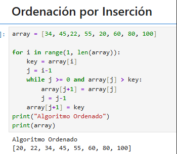

# Ordenación por Inserción

Los números a ser ordenados son conocidos como *keys* en ingles o *llaves*. Cuando queremos ordenar números. Cuando queremos ordenar números, a menudo es porque son las claves asociadas a otros datos, que llamamos *datos satelitales*. Juntos las *keys*  y datos *satelite* forman un registro. Por ejemplo considere una hoja de calculo que contiene registros de estudiantes con información asociada como la edad, promedio de calificaciones y el número de cursos tomados.

Cualquiera de estas cantidades podría ser una clave, pero cuando la hoja de cálculo ordena, mueve el registro asociado (los datos satelitales) con la clave.

Al describir un algoritmo de ordenación, nos centramos en las claves, pero es importante recordar que, por lo general, existen datos satelitales asociados.

Comenzamos con el algoritmo de ordenación por inserción, un algoritmo eficiente para ordenar un número pequeño de elementos. Este algoritmo funciona de forma similar a como se ordena una mano de cartas. Empieza con la mano izquierda vacía y las cartas apiladas sobre la mesa. Toma la primera carta de la pila y sujétala con la mano izquierda. Luego, con la mano derecha, retira una carta a la vez de la pila e insértala en la posición correcta de tu mano izquierda. Como se muestra en la Figura 2.1, encuentras la posición correcta de una carta comparándola con cada una de las cartas que ya tienes en la mano izquierda, comenzando por la derecha y moviéndote hacia la izquierda. En cuanto veas una carta en tu mano izquierda cuyo valor sea menor o igual que la carta que tienes en la mano derecha, inserta la carta que tienes en la mano derecha justo a la derecha de esta carta en tu mano izquierda. Si
todas las cartas de tu mano izquierda tienen un valor mayor que la carta de tu mano derecha,
entonces coloca esta carta como la carta más a la izquierda de tu mano izquierda. En todo momento, las cartas que sostienes en tu mano izquierda están ordenadas, y estas cartas eran originalmente las cartas superiores del
montón sobre la mesa.

**Invariantes de bucle y la corrección del algoritmo de ordenación por inserción**

El índice *i* indica la *carta actual* siendo insertado en la mano. Al comienzo de cada interacción del bucle for, el cual esta indexado por i, el subarray consistente en A`[1:i-1]` que constituye la mano ordenada actualmente y el subarray restante `A[i+1:n]` corresponde a la pila de cartas en la mesa. De hecho los elementos `A[1:i-1]` son elementos originalmente en posiciones 1 hasta i-1 pero ahora en orden ordenado. Nosotros declaramos estas propiedades de `A[1:i-1]` formalmente como ***bucle invariante***

El ***bucle invariante*** nos ayuda a entender por que el algoritmo es correcto. Cuando usamos el bucle invariante, tu necesitas mostrar tres cosas:

- **Inicialización:** Esto es cierto antes de la primera iteración del bucle.
- **Mantenimiento:** Si es verdadera antes de una iteración del bucle, seguirá siendo verdadera antes de la siguiente iteración.
- **Terminación:** El bucle termina y cuando termina la invariante generalmente junto con la razón de por que el bucle termino nos da una propiedad útil que ayuda a demostrar que el algoritmo es correcto.

Una ***Invariante de Bucle*** es una forma de inducción matemática, donde para probar que una propiedad se cumple, se demuestra un ***caso base*** y un ***paso inductivo***. En este caso, demostrar que la invariantes se cumple antes de la primera iteración corresponde al caso base y demostrar que se cumple de iteración en iteración corresponde al paso inductivo.

La tercera propiedad es quizá la mas importante, ya que se utiliza el invariante para demostrar la corrección. Normalmente se utiliza la invariante del bucle junto con la condición que provoco la terminación del bucle. La inducción matemática suele aplicar el paso inductivo indefinidamente, pero en un bucle, la inducción se detiene cuando el bucle termina.

**Veamos como se cumplen estas propiedades para el algoritmos de Ordenación por Inserción**

- **Inicialización:** Cuando empezamos la iteración el bucle invariante mantiene 

